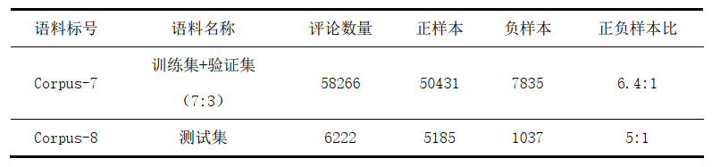

# sentiment-analysis

用MLP、TextCNN、RNN、LSTM、GRU、Attention、RCNN、BERT做文本分类、情感分析，对比各模型于温泉旅游评论垂类语料下在情感分类任务上的表现

## 简介

- 

- 

- 

- 

## 框架

- PyTorch
- huggingface/transformers
- scikit-learn
- pandas
- Matplotlib
- synonyms

## 模型

- MLP
  - MLP1H
  - MLP2H
  - MLP6H
- TextCNN
  - TextCNN1d
  - TextCNN2d
- RNNs
  - Bi-RNN
  - Bi-LSTM
  - Bi-GRU
- Attention
  - Bi-LSTM+Attention
- RCNN
- BERT
  - BERT
  - BERT+TextCNN2d
  - BERT+Bi-LSTM+Attention
  - BERT+RCNN

## 数据集

- 

- 

- 

## 训练过程

- MLP1H， MLP2H， MLP6H

- TextCNN1d， TextCNN2d

- Bi-RNN， Bi-LSTM， Bi-GRU

- Bi-LSTM+Attention， RCNN， Bi-LSTM

- BERT， BERT+TextCNN2D， BERT+Bi-LSTM+Attention， BERT+RCNN 

- MLP1H， TextCNN1D， Bi-LSTM+Attention， RCNN， BERT

## 实验结果

- 

## 参考

[https://github.com/jeffery0628/text_classification](https://github.com/jeffery0628/text_classification)
